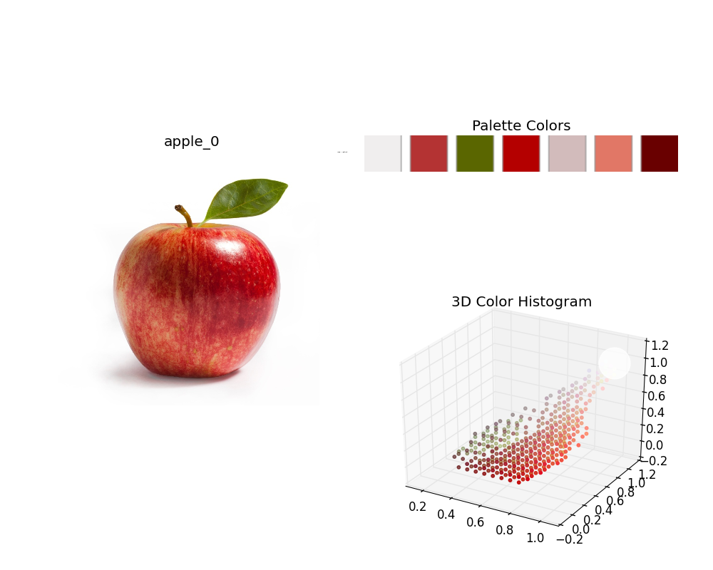
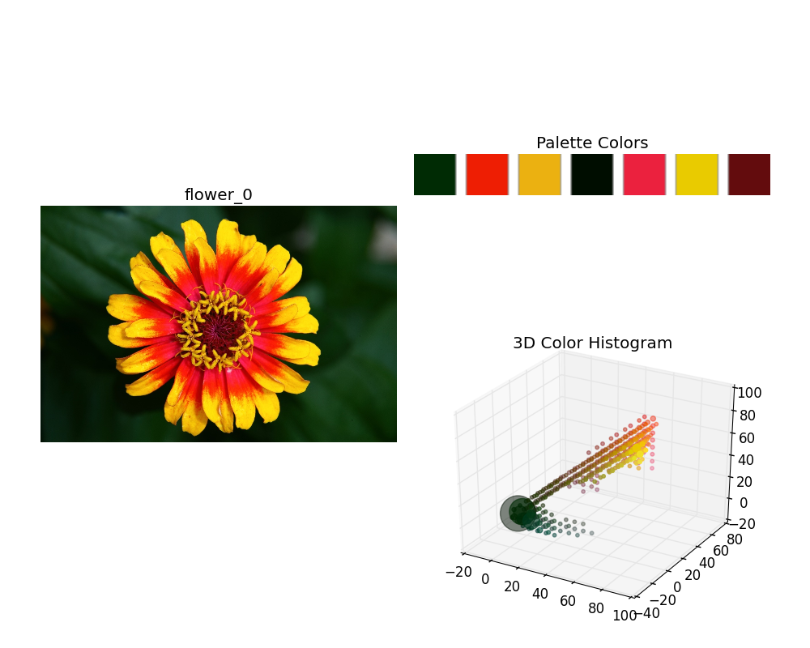
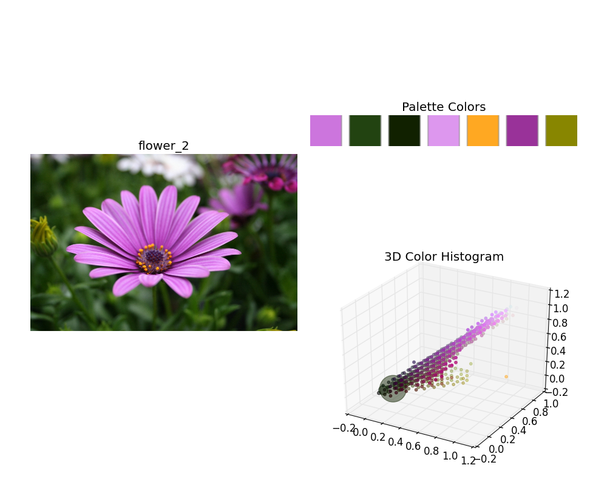
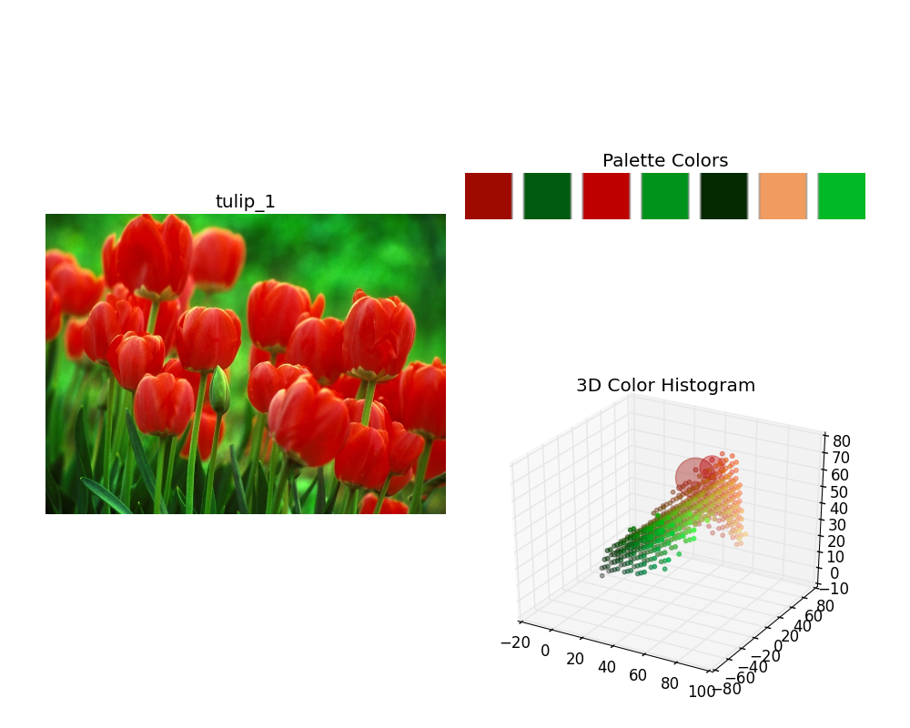

Automatic Color Palette Selection (Python)
====

Simple python demos of Automatic Color Palette Selection [Garcia-Dorado et al. 2015].

They proposed **palette-based photo recoloring** method for image editing.

I will implement automatic color palette selection part for a single image.

## Result
This program can generate color palettes for the target images.





## Installation

*Note*: This program was only tested on **Windows** with **Python2.7**.
**Linux** and **Mac OS** are not officially supported,
but the following instructions might be helpful for installing on those environments.

### Dependencies
Please install the following required python modules.

* **NumPy**
* **SciPy**
* **matplotlib**
* **OpenCV**

As these modules are heavily dependent on NumPy modules, please install appropriate packages for your development environment (Python versions, 32-bit or 64-bit).
For 64-bit Windows, you can download the binaries from [**Unofficial Windows Binaries for Python Extension Packages**](http://www.lfd.uci.edu/~gohlke/pythonlibs/).

This program also uses **docopt** for CLI.
**docopt** will be installed automatically through the following **pip** command for main modules.

### Install main modules
You can use **pip** command for installing main modules.
Please run the following command from the shell.

``` bash
  > pip install git+https://github.com/tody411/PaletteSelection.git
```

## Usage
### Package Structure
* palette: Main package.
    - main.py: Main module for testing.
* results: Result images will be saved in the directory.

### Test Palette Selection Demo
You can test the Palette Selection with the following command from ```palette``` directory.
``` bash
  > python main.py
```

This command will start downloading test images via Google Image API then run the Palette Selection module to generate result images.

<!-- ## API Document

API document will be managed by [doxygen](http://www.stack.nl/~dimitri/doxygen/) framework.
Online version is provided in the following link:
* [**inversetoon API Document**](http://tody411.github.io/InverseToon/index.html) (html)

For a local copy, please use the following doxygen command from *doxygen* directory.
``` bash
  > doxygen doxygen_config
``` -->

## Future tasks

* [ ] Compare the palette selection results depending on the target color space.

## License

The MIT License 2015 (c) tody